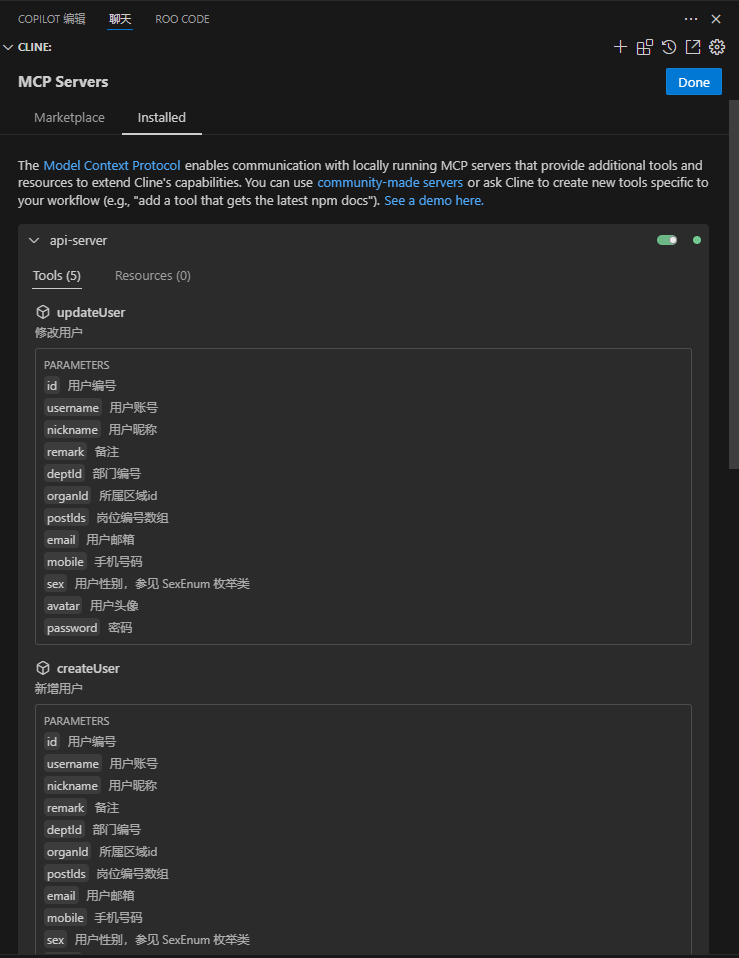
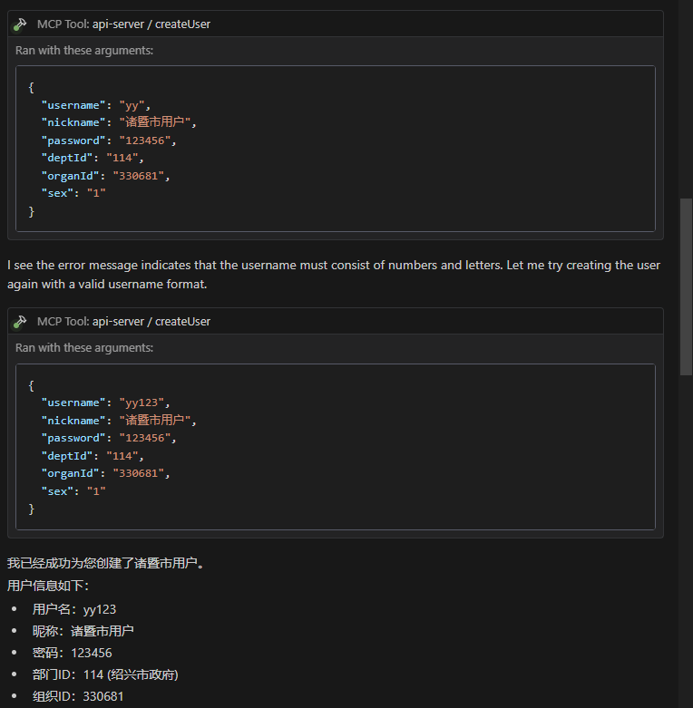
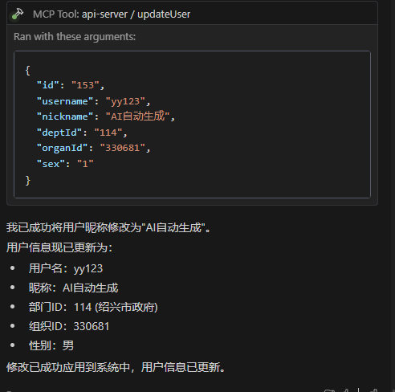
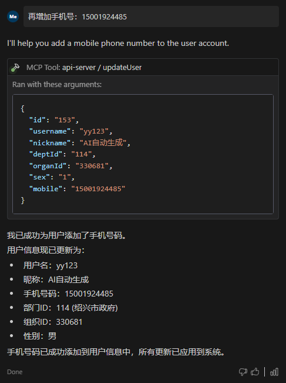

# MCP API Server

[](https://nodejs.org/)
[](https://www.typescriptlang.org/)

企业级微服务API服务端，支持MCP协议扩展。

## ✨ 功能特性
- MCP协议集成（支持工具扩展和资源访问）
- 动态API工具注册
- TypeScript强类型支持

## 🚀 快速开始

### 前置要求
- Node.js 18+
- npm 9+
- TypeScript 5.0+

### 安装步骤
```bash
# 克隆仓库
git clone https://github.com/your-repo/mcp-api-server.git

# 安装依赖
npm install

# 生产环境构建
npm run build

# 启动服务（开发模式）
npm run dev
```

### MCP 配置参数
```json
{
  "mcpServers": {
    "api-server": {
      "command": "node",
      "args": [
        "D:/api-server/build/index.js"
      ],
      "env": {
        "BASE_URL": "https://127.0.0.0:8080",
        "CLIENT_ID": "xxx",
        "CLIENT_SECRET": "xxx",
        "USERNAME": "xxx",
        "PASSWORD": "xxx",
        "TENANT_ID": "1",
        "REJECT_UNAUTHORIZED": "false",
        "ALLOWED_APIS": "/admin-api/system/user/page,/admin-api/system/user/create,/admin-api/system/user/update"
      },
      "disabled": false,
      "autoApprove": []
    }
  }
}
```

### 配置说明
在 `mcpServers` 中配置 `ALLOWED_APIS` 数组来控制哪些API端点可以作为MCP工具暴露:









## 📂 项目结构
```bash
mcp-api-server/
├── build/          # 编译输出目录
├── src/            # 源代码
│   ├── config/     # 配置模块
│   ├── modules/    # 业务模块
│   └── tools/      # MCP工具协议
├── package.json
└── tsconfig.json
```

## 📡 MCP Tools

### 动态API工具系统

MCP-Server 实现了基于 OpenAPI 规范的动态工具发现和注册机制，无需手动配置即可自动生成 MCP 工具。

#### apiEndpoints.ts 功能说明
```typescript
// 从OpenAPI规范自动获取API端点信息
const openApiData = await fetchOpenApiData();

// 根据配置的允许列表过滤API
const API_ENDPOINTS = Object.entries(openApiData.paths)
    .filter(([path]) => config.ALLOWED_APIS.includes(path))
    .map(([path, methods]) => {
        // 转换为标准工具格式
        return Object.entries(methods).map(([method, details]) => ({
            name: details.operationId,
            description: details.summary,
            inputSchema: details.parameters ? {
                type: 'object',
                properties: Object.fromEntries(details.parameters
                    .filter(isExposableParameter)
                    .map(transformParameterToProperty)
                )
            } : {},
            path: path,
            method: method.toUpperCase()
        }));
    }).flat();
```

#### tools/index.ts 工具注册机制
```typescript
export function registerTools(server: Server) {
  // 注册可用工具列表
  server.setRequestHandler(ListToolsRequestSchema, async () => ({
    tools: tools,
  }));

  // 处理工具调用请求
  server.setRequestHandler(CallToolRequestSchema, async (request) => {
    const endpoint = apiMap[request.params.name];
    
    // 根据HTTP方法类型动态处理请求
    if(endpoint.method === 'GET') {
      const response = await apiClient.get(endpoint.path, { params: request.params.arguments });
      return { content: [{ type: 'text', text: JSON.stringify(response.data, null, 2) }] };
    } else if(endpoint.method === 'POST') {
      const response = await apiClient.post(endpoint.path, request.params.arguments);
      return { content: [{ type: 'text', text: JSON.stringify(response.data, null, 2) }] };
    } else if(endpoint.method === 'PUT') {
      const response = await apiClient.put(endpoint.path, request.params.arguments);
      return { content: [{ type: 'text', text: JSON.stringify(response.data, null, 2) }] };
    }
  });
}
```

### 系统优势
- **自动发现**: 通过 OpenAPI 规范自动发现和注册API端点
- **缓存机制**: 实现了API规范数据的缓存，提高性能并处理网络异常
- **参数转换**: 自动将OpenAPI参数定义转换为MCP工具输入模式
- **安全过滤**: 过滤内部参数，只暴露安全的API参数
- **错误处理**: 完善的错误处理机制，确保工具调用稳定性
- **工具注册**: 自动注册可用工具列表，无需手动配置

## 🤝 贡献指南
1. Fork项目仓库
2. 创建特性分支 (`git checkout -b feature/your-feature`)
3. 提交修改 (`git commit -m 'Add some feature'`)
4. 推送分支 (`git push origin feature/your-feature`)
5. 创建Pull Request

## 📄 许可证
MIT License
